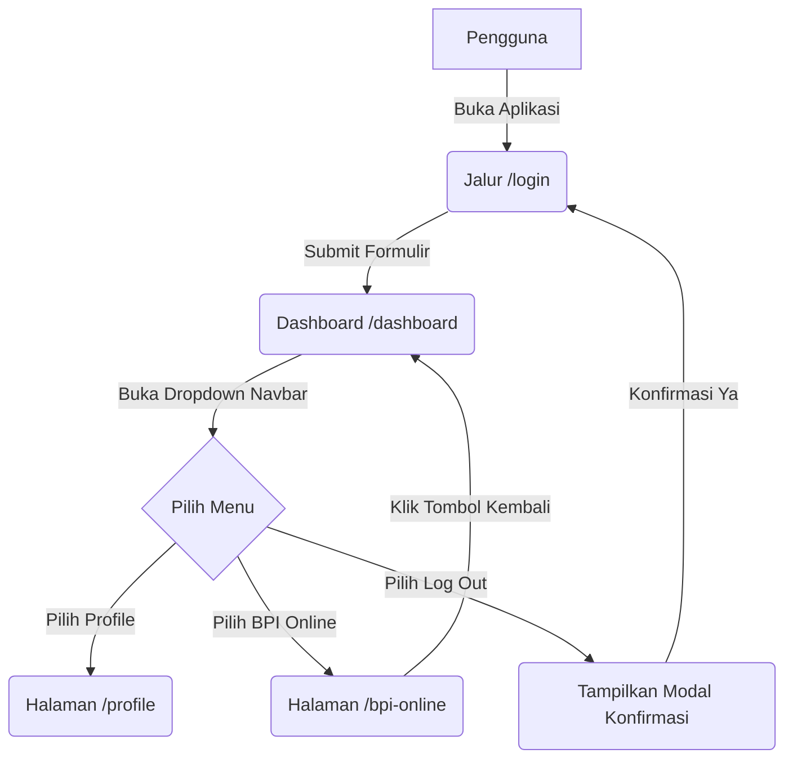

# Alur Aplikasi & Dokumentasi Rute (Flow & Routes Documentation)

Dokumen ini menjelaskan struktur kode, alur aplikasi, serta konfigurasi routing dalam proyek **Bakrie Ionic (Angular Standalone)**.

---

## 1. Struktur Folder & Desain Clean Code


```
src/app/
├── core/                       <-- Berisi aset logika global
│   ├── models/                 <-- Tipe data (interface TypeScript)
│   │   ├── user.model.ts       <-- Struktur data UserProfile
│   │   └── dashboard.model.ts  <-- Struktur data ModuleItem (grid menu)
│   └── services/               <-- Logika pemrosesan data (Mock API)
│       ├── user.service.ts     <-- Service penyedia profil pengguna
│       └── dashboard.service.ts<-- Service penyedia modul menu dashboard
│
├── layout/                     <-- Wrapper tata letak navigasi global
│   ├── layout.ts               <-- Logika menu dropdown & modal logout
│   ├── layout.html             <-- Template header & sidebar
│   └── layout.css              <-- Animasi dropdown & modal konfirmasi
│
└── pages/                      <-- Modul halaman mandiri (Standalone Pages)
    ├── login/                  <-- Halaman login utama
    ├── dashboard/              <-- Dashboard berisi modul aplikasi
    ├── profile/                <-- Halaman detail akun pengguna
    └── bpi-online/             <-- Portal mandiri berisi 20 aplikasi
```

---

## 2. Peta Rute Aplikasi (Routes Mapping)

Konfigurasi rute diatur secara terpusat pada berkas [app.routes.ts](file:///d:/DRL%20GITHUB/DRL/BAKRIE-IONIC/src/app/app.routes.ts) dengan struktur sebagai berikut:

| Jalur Rute (Path) | Komponen Terikat | Tipe Tampilan | Keterangan |
| :--- | :--- | :--- | :--- |
| `/login` | `LoginComponent` | Mandiri (Standalone) | Halaman otentikasi awal. |
| `/` | `LayoutComponent` | Kontainer Utama (Wrapper) | Menyediakan Header, Sidebar menu, & Notifikasi. |
| `├─ /dashboard` | `DashboardComponent` | Anak Rute (Child Route) | Menampilkan ringkasan data & grid modul utama. |
| `└─ /profile` | `ProfileComponent` | Anak Rute (Child Route) | Menampilkan detail data diri user login. |
| `/bpi-online` | `BpiOnlineComponent` | Mandiri (Standalone) | Portal 20 aplikasi dengan navigasi kembali mandiri. |
| `**` (Wildcard) | *Redirect* ke `/login` | - | Pengalihan otomatis jika jalur tidak ditemukan. |

---

## 3. Alur Navigasi & Aliran Data (Application Flows)



### Peta Aksi dan Navigasi Detail (Interaction Navigation Map)

Berikut adalah tabel rincian interaksi tombol/elemen dan arah navigasinya di setiap halaman:

| Asal Halaman (Rute) | Elemen / Tombol Interaktif | Trigger Aksi | Arah Tujuan Navigasi / Efek Samping |
| :--- | :--- | :--- | :--- |
| **Login (`/login`)** | Input Username (`#username`) | Ketik teks | Mengisi kredensial username (Default: `admin`). |
| | Input Password (`#password`) | Ketik teks | Mengisi kredensial kata sandi (Default: `password123`). |
| | Tombol "Eye Icon" (Mata) | Klik | Mengubah visibilitas kata sandi (Teks / Sensor). |
| | Tombol "Masuk" (`button[type=submit]`) | Klik (Submit) | Mengarahkan pengguna ke halaman **Dashboard (`/dashboard`)**. |
| **Global Layout Wrapper (`/dashboard` & `/profile`)** | Tombol Hamburger Menu (`.menu-btn`) | Klik | Membuka / menutup dropdown menu kanan atas. |
| | Dropdown Menu Item "Notifikasi" | Klik | Membuka popup daftar notifikasi secara *in-place* (tetap di halaman saat ini). |
| | Dropdown Menu Item "Profile" | Klik | Mengarahkan pengguna ke halaman **Profile (`/profile`)**. |
| | Dropdown Menu Item "BPI Online" | Klik | Mengarahkan pengguna ke halaman **BPI Online (`/bpi-online`)**. |
| | Dropdown Menu Item "Log Out" | Klik | Menampilkan Modal Pop-up konfirmasi log out dengan efek blur. |
| | Modal Logout - Tombol "Batal" | Klik | Menutup modal konfirmasi (tetap berada di halaman saat ini). |
| | Modal Logout - Tombol "Ya, Log Out" | Klik | Menghapus sesi masuk pengguna dan mengarahkan kembali ke **Login (`/login`)**. |
| **Dashboard (`/dashboard`)** | Tombol "NEXT" (Panah Kanan) | Klik | Mengganti daftar grid modul utama menjadi sub-modul (tetap di rute `/dashboard`). |
| | Tombol "PREVIOUS" (Panah Kiri) | Klik | Mengembalikan daftar grid sub-modul menjadi modul utama (tetap di rute `/dashboard`). |
| **BPI Online (`/bpi-online`)** | Tombol Kembali (Panah Kiri di atas) | Klik | Mengarahkan pengguna kembali ke halaman **Dashboard (`/dashboard`)**. |
| | Quick Action - "Absen" | Klik | Menampilkan notifikasi / placeholder presensi masuk. |
| | Quick Action - "Log" | Klik | Menampilkan notifikasi / placeholder riwayat log. |
| | Quick Action - "Approval" | Klik | Menampilkan notifikasi / placeholder persetujuan dokumen. |
| | Quick Action - "Bantuan" (WhatsApp) | Klik | Mengarahkan ke tautan chat bantuan eksternal (WhatsApp). |
| | Grid "My Application" (20 Ikon Emas) | Hover / Klik | Menyediakan visual interaktif (Modul ERP Bakrie Pipe Industries). |

---

### Penjelasan Detail Alur Kerja Komponen:

### A. Alur Halaman Login (`/login`)
1. Pengguna diarahkan ke halaman login.
2. Halaman ini menggunakan ornamen kurva estetis (`.login-wave`) dan pola titik (`.login-dots`) pada panel kiri sebagai penghias latar belakang visual.
3. Setelah tombol **Masuk** ditekan, aplikasi akan memanggil fungsi `onLogin()` di `login.ts` dan mengarahkan pengguna ke `/dashboard`.

### B. Alur Tata Letak Utama (`LayoutComponent` & Dropdown)
1. Setelah berhasil login, pengguna masuk ke kontainer utama (`LayoutComponent`).
2. Tata letak menyajikan header bertuliskan **e-Pipe** dengan profil kecil di kanan atas.
3. Dropdown profil menampilkan 4 menu utama:
   - **Notifikasi**: Menampilkan pemberitahuan aktif.
   - **Profile**: Mengarahkan ke rute `/profile`.
   - **BPI Online**: Mengarahkan ke rute `/bpi-online`.
   - **Log Out**: Menampilkan modal konfirmasi pop-up yang dirancang dengan efek kaca blur (*glassmorphism*).

### C. Alur Halaman BPI Online (`/bpi-online`)
1. Pengguna masuk ke halaman portal BPI Online secara mandiri (di luar `LayoutComponent`).
2. Sisi atas halaman menyajikan **Banner Card** dengan warna gradasi biru e-Pipe, kurva kaca putih transparan, dan foto profil lingkaran besar di tengah.
3. Di bawah foto profil terdapat **Quick Actions** untuk navigasi cepat:
   - **Absen** (ikon sidik jari)
   - **Log** (ikon riwayat jam)
   - **Approval** (ikon centang ganda)
   - **Bantuan** (ikon SVG resmi WhatsApp)
4. Sisi bawah menampilkan kartu **My Application** yang menyajikan 20 modul aplikasi dengan ikon dan label teks yang berwarna emas seragam (`#c5a85a`).
5. Menekan ikon **Kembali (Panah Kiri)** di pojok kanan atas akan mengembalikan pengguna ke `/dashboard`.

---

## 4. Aliran Data Berbasis Service (State Management)

Untuk mengikuti praktik clean code framework Ionic v8, data statis dan dinamis dipisahkan dari komponen tampilan menggunakan **Angular Service**:

1. **`UserService` (`user.service.ts`)**:
   - Berperan sebagai pusat penyimpanan data pengguna (*UserProfile*).
   - Menyediakan data: `Nama Lengkap`, `Divisi`, `Email`, `NIP`, `Status Akun`, dan tanggal bergabung.
   - Disuntikkan (*dependency injection*) ke dalam `LayoutComponent` (untuk sapaan nama di header), `ProfileComponent` (untuk informasi detail kartu identitas), dan `BpiOnlineComponent`.

2. **`DashboardService` (`dashboard.service.ts`)**:
   - Menyimpan seluruh array data daftar modul yang ditampilkan di grid menu dashboard utama.
   - Dipakai oleh `DashboardComponent` untuk merender menu secara dinamis menggunakan sintaks modern `@for`.
